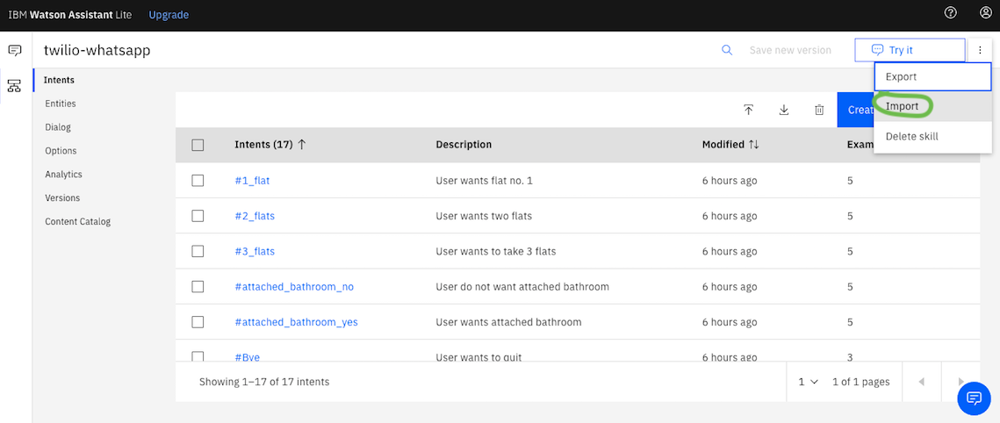
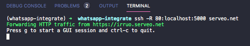
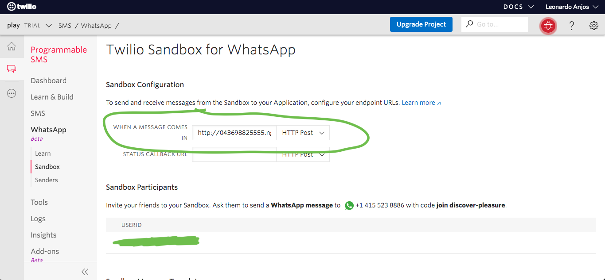

# conversation-bot-whatsapp

ibm watson conversation app with twilio whatsapp using webhooks

### requirements
- a smartphone with an active phone number and whatsapp installed
- ibm whatson and twilio account
- python version > 3.x

### development environment
```
$ git clone https://github.com/leonardo-anjos/conversation-bot-whatsapp.git

# install packages with pip
$ pip install -r requirements.txt

# auth ibm-watson (change in bot.py)
line 14 - authenticator = IAMAuthenticator('YOUR_API_KEY')
line 19 - workspace_id = 'YOU_WORKSPACE_ID'

# run 
$ python bot.py
```

### steps
1. upload skill-twilio-whatsapp.json file to ibm watson assistant workspace


2. open cmd/terminal then, ssh -R 80:localhost:5000 serveo.net
- copy url generated to expose url plublic and use in webhook


3. go to twilio sandbox for whatsapp to past your serveo link shown in cmd and `save` concat `/bot`
- eg: `https://irruo.serveo.net/bot`


4. send whatsapp from your phone to your twilio number
   
5. get reply


share with all of your friends 🖥️💡🧠🤖
